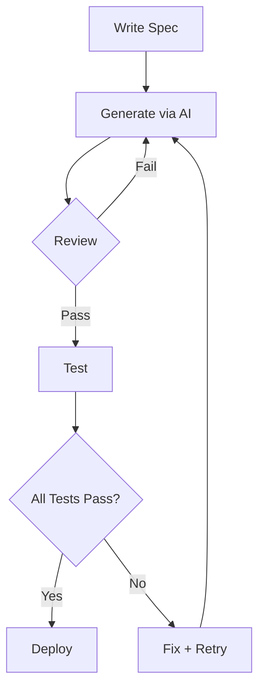

## TL;DR
- **What**: A complete workflow for using AI code generation in production development
- **Why**: A structured approach prevents common vibecoding pitfalls like security holes and inconsistent code
- **How**: Follow the spec→generate→review→test→deploy pipeline with AI augmentation at each step
- **Key Points**:
  - Write a detailed spec before asking AI to code
  - Generate incrementally — one function or component at a time
  - Review AI code as rigorously as human-written code
  - Keep your tests human-written for now
- **Pro Tip**: Create reusable prompt templates for common tasks (components, API routes, database queries)

---

## The Problem with Ad-Hoc Vibecoding

Jumping straight to "write me an app" prompts leads to:

- Inconsistent coding patterns across files
- Missing error handling and edge cases
- Security vulnerabilities (SQL injection, XSS)
- Code that doesn't integrate with your existing architecture

If you're new to vibecoding, start with the [Vibecoding: Getting Started](/blog/vibecoding-intro/) guide. For a curated list of the best tools, check [Best AI Tools for Vibecoding in 2026](/blog/vibecoding-tools/).

A structured workflow solves these problems.

## The Vibecoding Pipeline

## Phase 1: Spec (You)

Before any AI interaction, write a detailed specification:

```markdown
## Component: UserSettingsForm
- Fields: name, email, avatar (optional), password change
- Validation: email format, password strength (min 8 chars)
- States: loading, error, success
- API: PUT /api/users/:id
- Design: Dark theme, matches existing profile page
- Edge cases: Email already taken, network timeout
```

The more detail you provide, the better the AI output.

## Phase 2: Generate (AI)

Use your spec as the prompt. Break it into small chunks:

```markdown
❌ "Build me a user settings page with all the features"

✅ "Create a React form component for user settings with these fields: name, email.
Include email validation that shows inline error messages. 
Use this existing API pattern from my codebase: fetchPut().
Style it with CSS variables: --surface-color, --text-main, --error."
```

Each generation request should focus on ONE component or function.

## Phase 3: Review (You + AI)

Review every line of generated code:

```javascript
// ❌ Red flags to watch for
user.delete() // Is this idempotent?
eval(userInput) // Security risk!
process.env.API_KEY // Hardcoded?
try {} catch(e) {} // Swallowing errors?
```

Use AI for code review too:

```markdown
"Review this code for: 
1. Security vulnerabilities
2. Performance issues
3. Missing edge cases
4. Consistency with REST API patterns
5. Proper error handling"
```

## Phase 4: Test (You + AI)

Let AI generate unit tests, but add edge cases yourself:

```javascript
// AI-generated tests for a validation function
describe('validateEmail', () => {
  test('valid emails', () => {
    expect(validateEmail('user@example.com')).toBe(true);
    expect(validateEmail('a@b.co')).toBe(true);
  });
  
  // You add:
  test('injection attempts', () => {
    expect(validateEmail("' OR 1=1--")).toBe(false);
  });
});
```

## Phase 5: Deploy (Automated)

With proper tests in place, deployment can be CI/CD:

```bash
# Example deployment workflow
git push origin feature/settings-form
# → GitHub Actions runs tests
# → If tests pass, deploy to staging
# → If staging works, deploy to production
```

## Reusable Prompt Templates

Create a `prompts/` directory in your project:

**prompts/api-route.md:**
```markdown
Create an API route for {RESOURCE} with:
- GET (list with pagination)
- GET /:id (single item)
- POST (create with validation)
- PUT /:id (update)
- DELETE /:id (soft delete)
Use {ORM} for database operations.
Include error handling for {ERROR_CASES}.
Follow the existing pattern in {REFERENCE_FILE}.
```

**prompts/react-component.md:**
```markdown
Create a React component for {COMPONENT_NAME}:
- Props: {PROPS}
- States: loading, empty, error, success
- Use {STYLING} for styling
- Responsive: mobile-first
- Accessibility: proper labels, keyboard navigation
- Follow the pattern in {REFERENCE_COMPONENT}
```

## My Daily Vibecoding Loop



## Conclusion

Vibecoding is not magic — it's a skill that requires discipline. The developers who get the most out of AI are those who combine it with solid engineering practices. Write specs, review code, test thoroughly, and deploy responsibly.

Your vibecoding workflow will evolve. Start simple, iterate, and soon you'll be shipping features faster than ever before.
